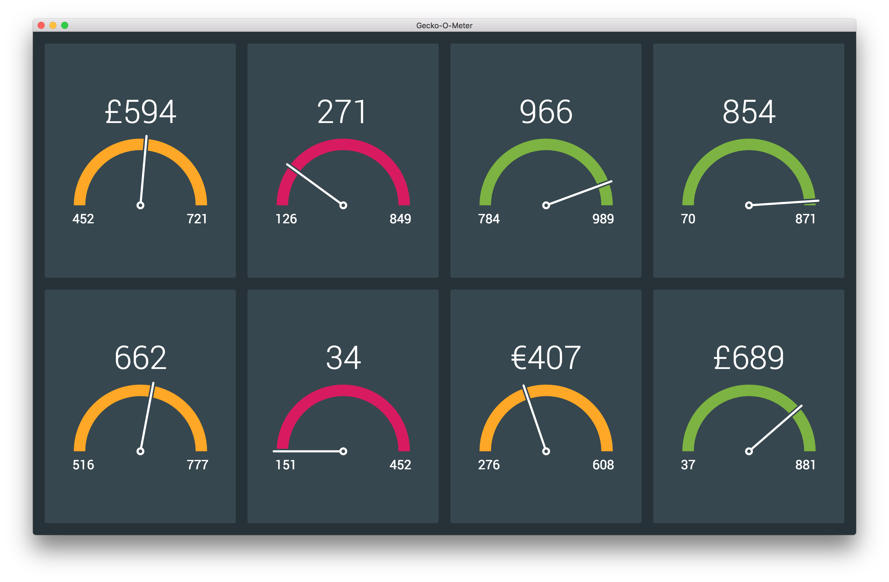

# gecko-o-meter



## Set up

To ensure this will run, please use at least `v6.0.0` of __Node.js__.

Once you have cloned the repository, run:

```
$ npm install
$ npm start
```

Then open your browser and go to `http://localhost:8080`.